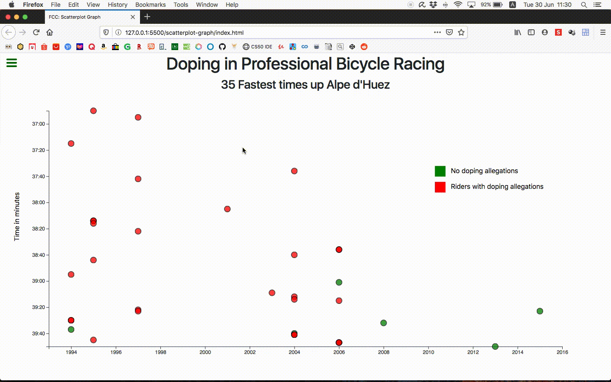

# Free Code Camp Project
## Data Visualisation: Scatterplot Graph



---

## [Project Requirements](https://www.freecodecamp.org/learn/data-visualization/data-visualization-projects/visualize-data-with-a-scatterplot-graph)

1. There is a title element that has a corresponding `id="title"`.
   
2. There is an x-axis that has a corresponding `id="x-axis"`.
   
3. There is a y-axis that has a corresponding `id="y-axis"`.
   
4. There are dots, that each have a class of dot, which represent the data being plotted.
   
5. Each dot should have the properties `data-xvalue` and `data-yvalue` containing their corresponding x and y values.
   
6. The `data-xvalue` and `data-yvalue` of each dot should be within the range of the actual data and in the correct data format. For `data-xvalue`, integers (full years) or Date objects are acceptable for test evaluation. For `data-yvalue` (minutes), use Date objects.
   
7. The `data-xvalue` and its corresponding dot should align with the corresponding point/value on the x-axis.
   
8. The `data-yvalue` and its corresponding dot should align with the corresponding point/value on the y-axis.
   
9.  There are multiple tick labels on the y-axis with `%M:%S` time format.
    
10. There are multiple tick labels on the x-axis that show the year.
    
11. The range of the x-axis labels are within the range of the actual x-axis data.
    
12. The range of the y-axis labels are within the range of the actual y-axis data.
    
13. There is a legend containing descriptive text that has `id="legend"`.
    
14. When moused over an area and there is a tooltip with a corresponding `id="tooltip"` which displays more information about the area.
    
15. The tooltip should have a `data-year` property that corresponds to the `data-xvalue` of the active area.
    
---

### Additional notes
In terminal:
1. Navigate to `scatterplot-graph`
2. ```sass``` should be installed
3. Run to reflect changes made to scss:
    `sass src/css/style.scss css/style.css`

---
