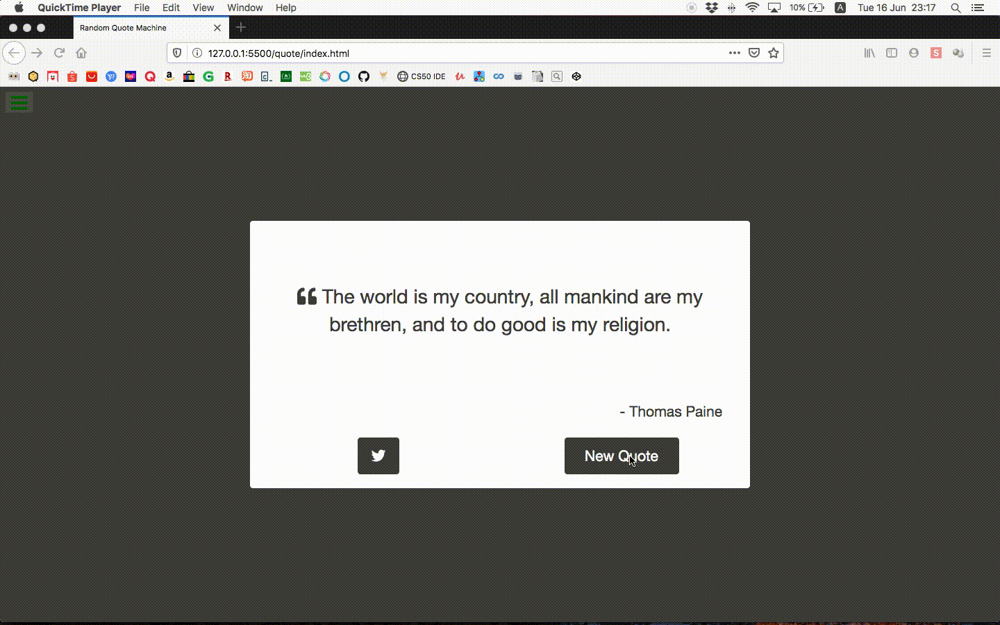

# Free Code Camp Project
## Front End Libraries: Random Quote Machine



---

## [Project Requirements](https://www.freecodecamp.org/learn/front-end-libraries/front-end-libraries-projects/build-a-random-quote-machine)

1. There is a wrapper element with a corresponding ``id="quote-box"``.

2. Within ```#quote-box```, there is an element with a corresponding ```id="text"```.

3. Within ```#quote-box```, there is an element with a corresponding ```id="author"```.

4. Within ```#quote-box```, there is a clickable element with a corresponding ```id="new-quote"```.

5. Within ```#quote-box```, there is a clickable a element with a corresponding ```id="tweet-quote"```.

6. On first load, the quote machine displays a random quote in the element with ```id="text"```.

7. On first load, the quote machine displays the random quote's author in the element with ```id="author"```.

8. When the ```#new-quote``` button is clicked, the quote machine should fetch a new quote and display it in the ```#text``` element.

9.  The quote machine should fetch the new quote's author when the ```#new-quote``` button is clicked and display it in the ```#author``` element.

10. The current quote can be tweeted by clicking on the``` #tweet-quote a``` element. This ```a``` element should include the ```"twitter.com/intent/tweet"``` path in its ```href``` attribute to tweet the current quote.

11. The ```#quote-box wrapper``` element should be horizontally centered. Run tests with browser's zoom level at 100% and page maximized.

---

### Additional notes
In terminal:
1. Navigate to `quote`
2. ```sass``` should be installed
3. Run to reflect changes to scss:
    `sass src/css/styles.scss css/styles.css`

---
