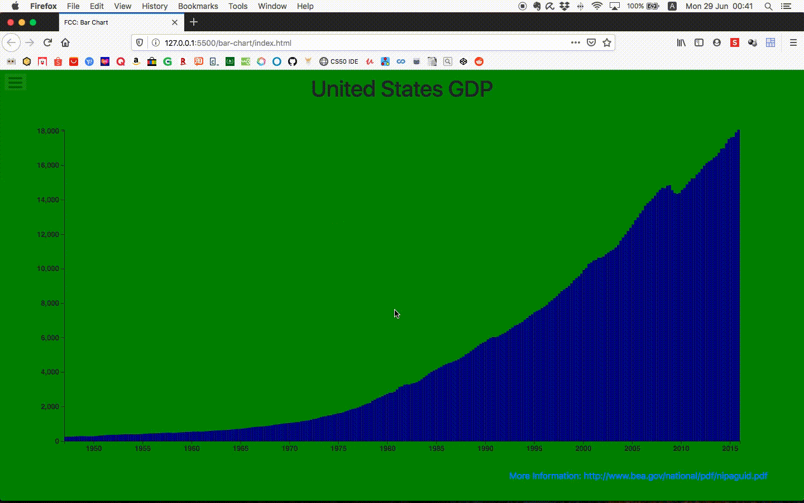

# Free Code Camp Project
## Data Visualisation: Bar Chart



---

## [Project Requirements](https://www.freecodecamp.org/learn/data-visualization/data-visualization-projects/visualize-data-with-a-bar-chart)

1. The chart should have a title with a corresponding `id="title"`. 
   
2. The chart should have a `g` element x-axis with a corresponding `id="x-axis"`.
   
3. The chart should have a `g` element y-axis with a corresponding `id="y-axis"`.
   
4. Both axes should contain multiple tick labels, each with the corresponding `class="tick"`.
5. 
6. My chart should have a `rect` element for each data point with a corresponding `class="bar"` displaying the data.
   
7. Each bar should have the properties `data-date` and `data-gdp` containing date and GDP values.
   
8. The bar elements' `data-date` properties should match the order of the provided data.
   
9.  The bar elements' `data-gdp` properties should match the order of the provided data.
    
10. Each bar element's height should accurately represent the data's corresponding GDP.
    
11. The `data-date` attribute and its corresponding bar element should align with the corresponding value on the x-axis.
    
12. The `data-gdp` attribute and its corresponding bar element should align with the corresponding value on the y-axis.
    
13. Whwn an area is moused over, a tooltip with a corresponding `id="tooltip"` which displays more information about the area.
    
14. The tooltip should have a `data-date` property that corresponds to the `data-date` of the active area.

---

### Additional notes
In terminal:
1. Navigate to `bar-chart/css`
2. ```sass``` should be installed
3. Run to reflect changes made to scss:
    `sass style.scss style.css`

---
